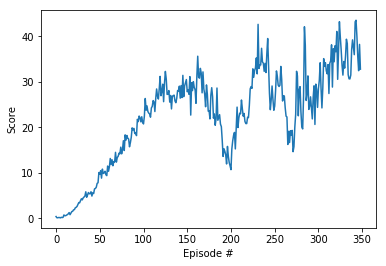

# Deep Reinforcement Learning - P2 Continuous Control

## Learning Algorithm

The agent is trained with the [DDPG algorithm](https://deepmind.com/research/publications/continuous-control-deep-reinforcement-learning/). 
DDPG uses four neural networks: a Q network, a deterministic policy network, a target Q network, and a target policy network. The Q network and policy network is very much like simple Advantage Actor-Critic, but in DDPG, the Actor directly maps states to actions (the output of the network directly the output) instead of outputting the probability distribution across a discrete action space

The target networks are time-delayed copies of their original networks that slowly track the learned networks. Using these target value networks greatly improve stability in learning. In the acting step, the agent passes the state vector through the Actor network and takes the action which is the output of the network. In the learning step, the Critic network is used as a feedback to the Actor network to change its weights such that the estimated value of the input state is maximized. Next, we update the *target* Actor and Critic weights by making a copy of the current weights of the local Actor and Critic networks.

**Architecture of Actor Network**

- input size = 33
- output size = 4
- 2 hidden layers and one output layer
- first hidden layer has 512 hidden units and second hidden layer has 256 hidden units and is followed by a `ReLU` activation layer
- We have a batch normalization layer after the first layer
- output layer is followed by a tanh activation layer

**Architecture of Critic Network**

- input size = 4
- output size = 1
- 2 hidden layers and one output layer
- first hidden layer has 512 hidden units and second hidden layer has 256 hidden units and is followed by a `ReLU` activation layer
- We have a batch normalization layer after the first layer
- output layer is followed by a linear activation unit

**Hyperparameters**

```
BUFFER_SIZE = int(1e5)  # replay buffer size
BATCH_SIZE = 512        # minibatch size
GAMMA = 0.99            # discount factor
TAU = 1e-3              # for soft update of target parameters
LR_ACTOR = 1e-4         # learning rate of the actor
LR_CRITIC = 3e-4        # learning rate of the critic
WEIGHT_DECAY = 0        # L2 weight decay
```

## Plot of Rewards


The agent was able to resolve the environment in 249 episodes.

## Observations/Issues

* Agent seems to learn very slowly initially and then pick up the rewards as we cross the 25th Epoch.

* Using a Batch Normalization layer really helped.

## Ideas for Future Work
- [Proximal Policy Optimization](https://arxiv.org/abs/1707.06347)
  - The idea is to implement a Policy Gradient algorithm that determines the appropriate policy with gradient methods. However, the change in the policy from one iteration to another is very slow in the neighbourhood of the previous policy in the high dimensional space.
- [Prioritized Experience Replay](https://arxiv.org/abs/1511.05952)
  - The idea behind using these technique for sampling from the replay buffer is that not all experiences are equal, some are more important than others in terms of reward, so naturally the agent should at least prioritize between the different experiences.
- [Asynchronous Actor Critic](https://medium.com/emergent-future/simple-reinforcement-learning-with-tensorflow-part-8-asynchronous-actor-critic-agents-a3c-c88f72a5e9f2)
  - The idea is to have a global network and multiple agents who all interact with the environment separately and send their gradients to the global network for optimization in an asynchronous way.